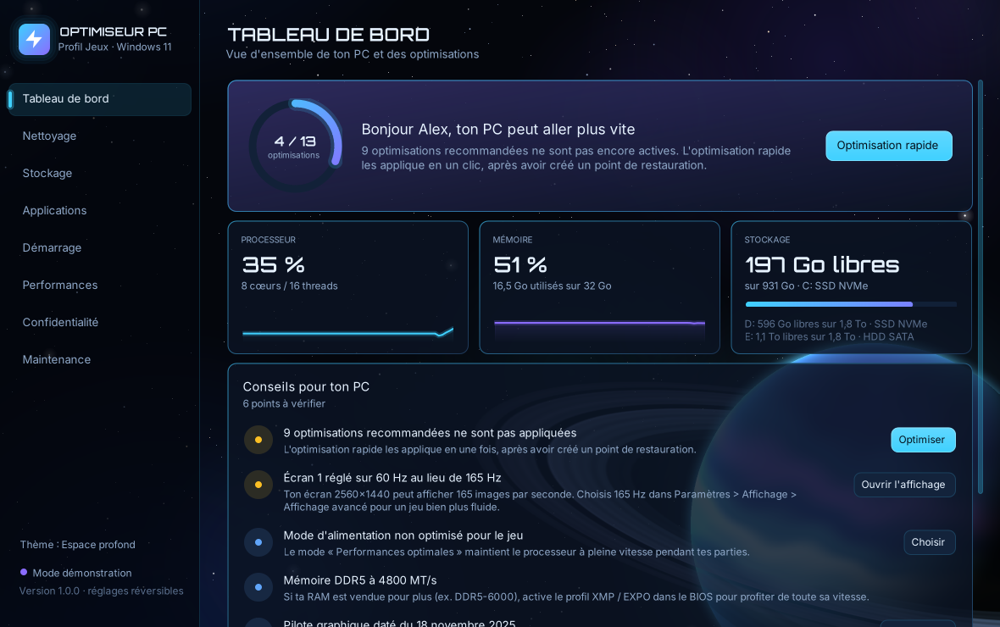

# Optimiseur PC — téléchargements

Une application Windows pour centraliser le nettoyage, le stockage, les applications, les programmes au démarrage et les réglages de performances.

**Version actuelle : 1.0.0 bêta.**

## Télécharger

**[Télécharger Optimiseur PC 1.0.0 — pack ZIP](https://github.com/orbite-zero/optimiseur-pc-telechargements/releases/download/v1.0.0/OptimiseurPC-1.0.0.zip)**

Le pack contient l'application, un guide rapide et les notices de licence.

[Fichier EXE seul](https://github.com/orbite-zero/optimiseur-pc-telechargements/releases/download/v1.0.0/OptimiseurPC.exe) · [Notes de version et licences](https://github.com/orbite-zero/optimiseur-pc-telechargements/releases/tag/v1.0.0) · [Signaler un problème](https://github.com/orbite-zero/optimiseur-pc-telechargements/issues)



## Utilisation

1. Télécharge le pack ZIP et extrais son contenu.
2. Ouvre `OptimiseurPC.exe`. Les modifications des réglages Windows nécessitent les droits administrateur.
3. Crée le point de restauration proposé avant la première modification.

**Configuration prévue :** Windows 11 64 bits avec .NET Framework 4.8. Windows 10 n'a pas été testé.

L'application est en bêta et n'est pas signée numériquement. Windows peut donc afficher un avertissement. Vérifie la provenance du fichier avant de l'exécuter.

Pour découvrir l'interface sans modifier le PC, ouvre PowerShell dans le dossier de l'application et lance :

```powershell
.\OptimiseurPC.exe --demo
```

**Maintenance > Tout annuler** restaure les réglages sauvegardés. Les suppressions de fichiers, le nettoyage des composants Windows et les désinstallations ne sont pas annulés par ce bouton.

## Vérifier le téléchargement

Les empreintes SHA-256 du pack et de l'exécutable figurent dans [SHA256SUMS.txt](SHA256SUMS.txt).

```powershell
Get-FileHash .\OptimiseurPC.exe -Algorithm SHA256
```

## Licence de la version 1.0.0

La version 1.0.0 a été publiée sous [licence MIT](LICENSE) et conserve cette licence. La police Orbitron intégrée est fournie sous [licence SIL Open Font License 1.1](Orbitron-OFL.txt). Les deux notices sont incluses dans le pack ZIP et proposées avec la version téléchargeable.
